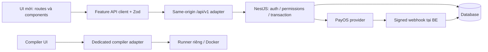
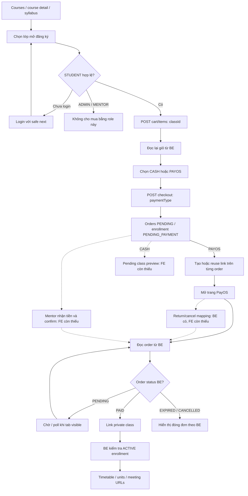
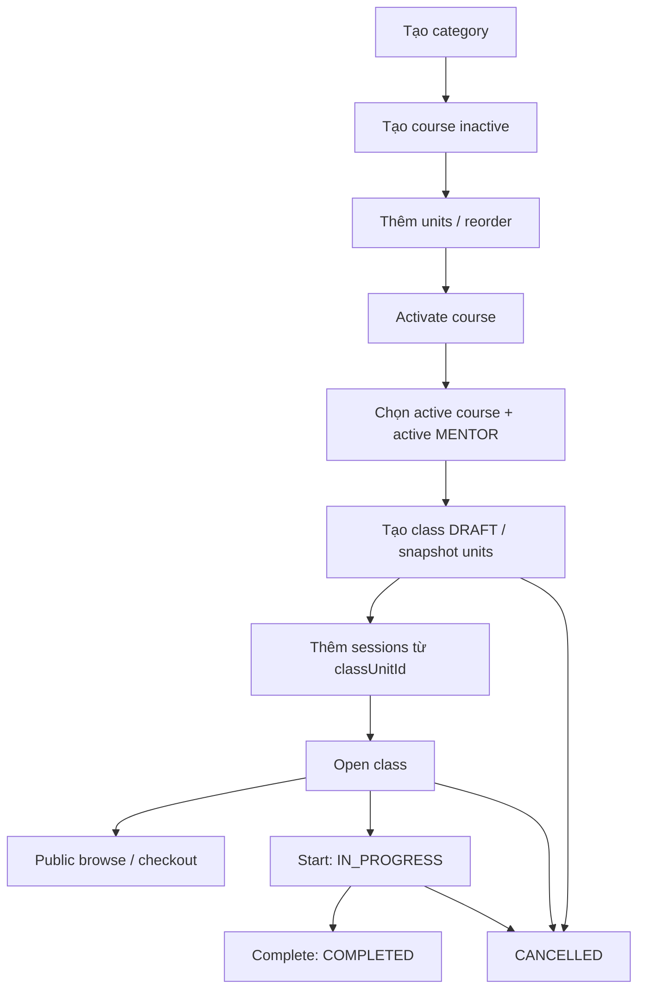

# Mindy FE — API audit và logic flow cho lần làm lại UI

Ngày kiểm tra: **06/10/2026**. Tài liệu mô tả source tại checkout hiện tại, dùng để bàn giao sang branch UI mới.

| Repo | Branch kiểm tra | HEAD |
| --- | --- | --- |
| Mindy-FE | `feat/ui-exploration-blue-white` | `460b8d6` |
| Mindy-BE | `Feat/Webhooktest` | `01fc1eb` |

## 1. Kết luận: đã gắn đủ API chưa?

**Chưa đủ so với BE hiện tại.** Auth, quản trị users/catalog/classes, public catalog, giỏ hàng, checkout, own orders, tạo link PayOS, private class và ADMIN reconciliation đã có API client + schema + UI consumer.

Đối chiếu các controller BE với policy BFF bằng method/path, thay path parameter bằng UUID hợp lệ, cho kết quả:

- BE có **55 endpoint** trong các controller hiện tại.
- **49 endpoint** được FE hỗ trợ qua generic BFF hoặc dedicated Google adapters.
- **4 endpoint nghiệp vụ đã có BE nhưng chưa gắn FE**: payment-result mapping, mentor cash-order list, mentor cash confirmation, student pending CASH preview.
- **2 endpoint còn lại thuộc hạ tầng**: `GET /health/ready` và `POST /payment-callbacks/payos`. Không cần đưa webhook provider qua FE để hoàn tất UI.

Đây là coverage source/adapter, không phải chứng nhận hoạt động live. Đã đọc thêm API clients, schemas, route composition và component consumers để xác định các luồng hiện hữu; chưa chạy giao dịch PayOS thật, Google OAuth thật hoặc SMTP ngoài trong lần audit này.

FE đang ghi baseline BE `5c9e581` trong tài liệu cũ. BE đã tiến thêm commit `a1bf621` (CASH + result mapping) và `01fc1eb` (PayOS adapter). Vì vậy các câu “cash confirmation/preview/result mapping chờ BE” trong snapshot cũ đã lỗi thời; các phần này hiện **chờ FE**.

## 2. Những thiếu sót cần mang sang branch mới

| Mức | Thiếu sót đã xác minh | Ảnh hưởng và việc cần làm |
| --- | --- | --- |
| Ưu tiên 1 | Chưa có `/payment/result`, client và BFF cho `GET /me/orders/payment-result` | Sau return/cancel từ PayOS chưa có màn hình lookup internal order. Thêm route, query validation, schema, exact allowlist và xử lý session/ownership. |
| Ưu tiên 1 | Chưa có UI/client/BFF cho hai API `/mentor/cash-orders` | MENTOR chưa xem đơn CASH được giao hoặc xác nhận thu đủ tiền trong FE. Tạo khu vực MENTOR riêng; ADMIN không được quyền confirm theo BE. |
| Ưu tiên 1 | Chưa có UI/client/BFF cho `/me/classes/:classId/preview` | STUDENT CASH pending chưa xem lịch/room/titles qua quyền preview. Tách preview khỏi full learning; sau PAID dùng endpoint full class. |
| Ưu tiên 2 | `paymentSchema` chưa khai báo `providerOrderCode` | BE trả `number|null`; Zod hiện chấp nhận response nhưng loại trường này khỏi parsed result. Không làm hỏng đọc đơn hiện tại, nhưng chưa giữ đầy đủ contract mapping mới. |
| Ưu tiên 2 | `safeReturnTo` chưa chấp nhận `/learning/classes/:classId` và `/management/payments/reconciliation` | Sau đăng nhập lại, user bị fallback về role home thay vì trang cũ. Khi thêm `/payment/result` và mentor routes, cập nhật policy này và Google redirect policy liên quan. |
| Ưu tiên 2 | Copy CASH ở order detail vẫn nói “Hệ thống chưa có thao tác xác nhận tiền mặt” | BE đã có confirm. Khi nối CASH UI, sửa copy theo trạng thái thực tế và hướng dẫn chờ mentor xác nhận. |
| Backlog BE | Chưa có `GET /me/classes`, progress read/write hoặc dashboard API | Orders PAID có thể dẫn tới classId, nhưng lịch sử mua không thay thế danh sách enrollment tổng quát. Không tự dựng progress/attendance từ order. |

Các thiếu sót trên được ghi nhận để triển khai tiếp; audit này không thay đổi runtime nghiệp vụ hoặc giao diện.

Nguồn trực tiếp: [BFF policy](../src/shared/lib/http/proxy-policy.ts), [payment schema](../src/features/payments/schemas/payment.schema.ts), [return-path policy](../src/features/auth/permissions/access-policy.ts), [order detail](../src/features/orders/components/order-detail-page.tsx), [BE payments controller](../../Mindy-BE/src/modules/payments/controllers/payments.controller.ts), [BE CASH controller](../../Mindy-BE/src/modules/payments/controllers/cash-payments.controller.ts).

## 3. Bản đồ route → dữ liệu → quyền

Route dưới đây là route UI; API ở phần 4 đều thêm prefix `/api/v1` khi gọi HTTP.

| Route UI hiện có | Quyền | Dữ liệu/hành động |
| --- | --- | --- |
| `/` | Public | Landing tĩnh và navigation; nút health gọi `/health/live`, không có dashboard/course-feed API trên landing. |
| `/login` | Public | Password login, Google start, safe `next` và redirect theo role. |
| `/register` | Public | Đăng ký STUDENT, thông báo chờ email, resend. |
| `/verify-email?token=...` | Public | Người dùng chủ động verify; thành công thiết lập session. |
| `/login/google/callback` | Public | Finalize callback một lần qua dedicated BFF dưới session lock. |
| `/register/complete` | Registration intent | Đọc context Google, hoàn tất displayName/phone, thiết lập session. |
| `/courses` | Public | Categories + course page; bộ lọc và phân trang trên URL. |
| `/courses/:courseId` | Public | Course detail/units, paginated open classes, chọn lớp để mua. |
| `/courses/:courseId/units/:unitId` | Public | Đọc course detail, tìm unit thuộc course; chỉ syllabus public. |
| `/classes/:classId` | Public | Class detail, unit/session titles, lịch/room và CTA thêm classId vào giỏ. |
| `/account` | Đã đăng nhập | Session user/profile chỉ đọc, logout-all. |
| `/cart` | STUDENT | Own cart, xóa lớp, tổng do BE trả, tới checkout. |
| `/checkout` | STUDENT | Cart + recent orders; chọn CASH/PAYOS, tạo đơn, recovery khi mất response. |
| `/orders` | STUDENT | Own orders, page/pageSize/status trên URL. |
| `/orders/:orderId` | STUDENT owner | Order + payment, pending polling, create/reuse PayOS, dẫn tới private class khi PAID. |
| `/learning/classes/:classId?unitId=...` | STUDENT + ACTIVE enrollment | Private class, timetable, unit selection và meeting URLs do BE cho phép. |
| `/management/users` | ADMIN | User page, lọc role/status, pagination. |
| `/management/users/new` | ADMIN | Tạo managed user. |
| `/management/users/:userId` | ADMIN | Chi tiết và đổi ACTIVE/SUSPENDED theo BE. |
| `/management/course-categories` | ADMIN | Active category list và tạo category. |
| `/management/courses` | ADMIN | Management courses gồm inactive, lọc category/isActive. |
| `/management/courses/new` | ADMIN | Tạo inactive course. |
| `/management/courses/:courseId` | ADMIN | Sửa fields/ảnh, add/reorder units, activate; selection `?unitId=...`. |
| `/management/classes` | ADMIN | Management classes, bộ lọc và pagination. |
| `/management/classes/new` | ADMIN | Active course/mentor pickers, tạo DRAFT class. |
| `/management/classes/:classId` | ADMIN | Sửa fields, thêm session, lifecycle commands; selection `?unitId=...`. |
| `/management/payments/reconciliation` | ADMIN | Review events, pagination, reconcile theo paymentId và refetch. |
| `/compiler` | Public hiện tại | JavaScript playground → runner riêng; chưa liên kết class/progress. |
| `/learnthru` | Preview | Dashboard dữ liệu mẫu, không gọi API nghiệp vụ. |
| `/ui-lab`, `/ui-lab/ocean-editorial/:view` | Preview | Fixtures và cart preview riêng; không phải product cart/payment. |

MENTOR hiện vào `/account`; chưa có màn hình nghiệp vụ CASH. ADMIN mặc định về `/management/users`, STUDENT/MENTOR mặc định về `/account`.

**Route cần bổ sung sau này:** `/payment/result` được BE contract chỉ định. Đường UI cho mentor cash orders và student cash preview cần chọn trên branch mới; không có route hiện hữu để tự coi là đã triển khai.

## 4. Inventory API hiện có

Các hàng ghi nhiều method/path là nhóm endpoint riêng; không phải một request gọi cùng lúc. `:id` bên dưới đại diện UUID tương ứng. Tất cả nhóm đánh dấu “Đã gắn” đã có consumer sản phẩm, trừ session APIs được provider dùng gián tiếp.

### 4.1 Identity và users — 16 endpoint, đã gắn

| Method | Path | Consumer/chức năng |
| --- | --- | --- |
| POST | `/auth/register` | Register, 202 message, chưa cấp session. |
| POST | `/auth/email/resend` | Resend email xác thực. |
| POST | `/auth/email/verify` | Verify token → session. |
| POST | `/auth/login` | Password login → session. |
| POST | `/auth/refresh` | Session recovery. |
| POST | `/auth/logout`, `/auth/logout-all` | Logout thiết bị hiện tại/tất cả. |
| GET | `/auth/me` | Bootstrap identity và kiểm tra principal trước private mutations. |
| GET | `/auth/google`, `/auth/google/callback` | Dedicated navigation adapters; callback finalize browser POST được adapter đổi sang BE GET. |
| GET | `/auth/registration-context` | Google onboarding context. |
| POST | `/auth/google/complete-registration` | Google onboarding → session. |
| GET, POST | `/admin/users` | ADMIN list/create. |
| GET | `/admin/users/:userId` | ADMIN detail. |
| PATCH | `/admin/users/:userId/status` | ADMIN update status. |

Nguồn FE: [auth client](../src/features/auth/api/auth.browser.ts), [users client](../src/features/users/api/users.browser.ts), [Google server adapter](../src/features/auth/api/google.server.ts).

### 4.2 Catalog + public browse — 13 endpoint, đã gắn

| Method | Path | Chức năng |
| --- | --- | --- |
| GET | `/course-categories` | Active categories, có pagination. |
| POST | `/admin/course-categories` | Tạo category. |
| GET, POST | `/admin/courses` | Management list/create. |
| GET, PATCH | `/admin/courses/:courseId` | Management detail/update fields. |
| POST | `/admin/courses/:courseId/units` | Append unit. |
| PUT | `/admin/courses/:courseId/units/order` | Reorder bằng `{unitIds}` gồm toàn bộ unit IDs đúng một lần. |
| POST | `/admin/courses/:courseId/activate` | Activate course. |
| GET | `/courses` | Public course page. |
| GET | `/courses/:courseId` | Public course detail + syllabus + nhóm open classes đầu tiên. |
| GET | `/courses/:courseId/classes` | Public class page theo course. |
| GET | `/classes/:classId` | Public class detail/timetable. |

Nguồn FE: [admin catalog client](../src/features/catalog/api/catalog.browser.ts), [public catalog client](../src/features/catalog/api/public-catalog.browser.ts).

### 4.3 Admin classes — 9 endpoint, đã gắn

| Method | Path | Chức năng |
| --- | --- | --- |
| GET, POST | `/admin/classes` | Management list/create DRAFT. |
| GET, PATCH | `/admin/classes/:classId` | Detail/update fields theo lifecycle. |
| POST | `/admin/classes/:classId/sessions` | Thêm lịch vào class unit. |
| POST | `/admin/classes/:classId/open` | DRAFT → OPEN. |
| POST | `/admin/classes/:classId/start` | OPEN → IN_PROGRESS. |
| POST | `/admin/classes/:classId/complete` | IN_PROGRESS → COMPLETED. |
| POST | `/admin/classes/:classId/cancel` | Hủy class chưa kết thúc theo BE. |

Nguồn FE: [classes client](../src/features/classes/api/classes.browser.ts), [class rules](../src/features/classes/domain/class-rules.ts).

### 4.4 Student commerce/payment/learning và ADMIN reconciliation — 10 endpoint, đã gắn

| Method | Path | Chức năng |
| --- | --- | --- |
| GET | `/me/cart` | Own cart. |
| POST | `/me/cart/items` | Add `{classId}`. |
| DELETE | `/me/cart/items/:classId` | Remove, 204. |
| POST | `/me/cart/checkout` | `{paymentType}` → `{orders}`. |
| GET | `/me/orders` | Own order page. |
| GET | `/me/orders/:orderId` | Own order + nullable payment. |
| POST | `/me/orders/:orderId/payments/payos` | Body `{}` → create/reuse Payment. |
| GET | `/me/classes/:classId` | Private class, ACTIVE enrollment. |
| GET | `/admin/payments/reconciliation` | Review event page. |
| POST | `/admin/payments/:paymentId/reconcile` | Body `{}` → `{status}`, rồi đọc lại list. |

Nguồn FE: [cart client](../src/features/cart/api/cart.browser.ts), [orders client](../src/features/orders/api/orders.browser.ts), [payments client](../src/features/payments/api/payments.browser.ts), [learning client](../src/features/learning/api/learning.browser.ts).

### 4.5 Bốn endpoint BE có sẵn, FE chưa gắn

| Method/path | Quyền | Input → response |
| --- | --- | --- |
| `GET /me/orders/payment-result` | STUDENT owner | Query chỉ `orderCode` → cùng order detail/payment DTO; trả internal `id`. |
| `GET /mentor/cash-orders` | MENTOR được gán trong order snapshot | `page,pageSize` → Order page, gồm lịch sử các status, không có status filter trong DTO hiện tại. |
| `POST /mentor/cash-orders/:orderId/confirm` | MENTOR được gán trong order snapshot | `{receivedAmount}` → Order, HTTP 200. Số nguyên VND ≥1, đúng toàn bộ tổng đơn. |
| `GET /me/classes/:classId/preview` | STUDENT có CASH pending hold còn hạn | Public-shaped class detail, titles/timetable/room; không có meeting URL. |

`orderCode` lookup là mã số PayOS giữ dưới dạng chuỗi, regex `^[1-9][0-9]{0,15}$`; BE còn kiểm tra safe integer. Không nhầm với `Order.orderCode` mã Mindy dạng `MD...` hoặc `Order.id` UUID. FE hiện chưa cho các path này qua generic BFF, gọi same-origin sẽ bị từ chối trước khi đến BE.

### 4.6 Hạ tầng và runner

| API | Trạng thái |
| --- | --- |
| `GET /health/live` | Đã gắn nút health trên landing, tính trong 49 endpoint. |
| `GET /health/ready` | Có BE; FE không proxy, thuộc readiness hạ tầng. |
| `POST /payment-callbacks/payos` | Có BE; provider gọi trực tiếp BE, xác minh signature/settlement ở BE. |
| `POST /api/v1/compiler/run` | Dedicated FE adapter → runner `POST /api/code/run`; không thuộc 55 endpoint Mindy-BE. |

## 5. Logic flow cần giữ khi thay UI

### 5.1 Ranh giới dữ liệu

UI được đổi layout, component và styling; giá, seat holds, owner, PAID/ACTIVE và lifecycle vẫn lấy từ BE. Browser không gọi trực tiếp BE hoặc provider để tự xác nhận thanh toán.

### 5.2 Session, login và quyền

1. `SessionProvider` bắt đầu `loading` → `GET /auth/me`.
2. Nếu 401: lấy session lock, đọc lại `/auth/me`, chỉ refresh khi vẫn cần. Thành công bind identity trong memory → `authenticated`; thiếu session → `anonymous`; lỗi mạng/config → `error` có reload.
3. Private layout chỉ render dữ liệu sau bootstrap. Anonymous → `/login?next=<route/query/hash>`; logout chủ động → `/login`.
4. Password login hoặc verify/Google completion thiết lập session cookies và session user; thông báo các tab qua BroadcastChannel. Google callback được finalize một lần dưới lock, bỏ code/state khỏi URL.
5. ADMIN được vào management. Cart/checkout/orders/learning chỉ STUDENT. MENTOR không được dùng management hoặc student purchase APIs.
6. `authenticatedRequest` giữ shared session lock cho mutation, kiểm tra identity qua `/auth/me` trước gửi. Account/generation đổi → dừng và reload session. Chỉ replay một lần khi guard trả `401 AUTHENTICATION_REQUIRED`; không tự replay network failure/403/409.
7. Khi logout/đổi account/unmount: hủy request và bỏ dữ liệu private cũ. Component private được key theo principal; response đến muộn không được ghi vào UI phiên mới.

Cookie HttpOnly do BE cấp; access path `/`, refresh path `/api/v1/auth/refresh`. Không persist raw token, user, cart hoặc orders vào browser storage. Google registration intent có cookie policy riêng.

### 5.3 Discovery → cart → checkout → vào lớp

Nét đứt mô tả luồng BE đã hỗ trợ nhưng FE còn thiếu. Diagram không đánh dấu các bước đó là UI đã có.

**Discovery/cart:** bán theo **classId**, không add courseId. Unit/course viewer là syllabus public. Cart mỗi lớp quantity 1, tối đa 20 items. Đọc `priceSnapshot`, `currentPriceAmount`, `isPurchasable` và tổng từ DTO; giá/chỗ hiển thị vẫn cần BE kiểm tra lại tại checkout. Add/remove thành công, conflict hoặc unknown result đều cần đọc lại giỏ; thông báo `mindy:cart-changed` chỉ yêu cầu consumer refetch.

**Checkout:** payload chỉ `{paymentType: 'CASH'|'PAYOS'}`. BE lấy student từ session, giá hiện tại từ catalog, kiểm tra khả dụng và transaction. PAYOS tạo một order cho giỏ; CASH chia orders theo mentor. Hiển thị đủ `orders[]`, không lấy riêng phần tử đầu. Thành công BE xóa giỏ và tạo holds. TTL mặc định PAYOS 15 phút/CASH 48 giờ là config BE; UI lấy `expiresAt` thực tế.

**Unknown checkout:** giữ `CheckoutFlow` hoặc hành vi tương đương. State chính: `loading → ready → submitting → success`; khi mất kết quả: `unknown → checking → recovered/retryable/unknown`. Đọc cart + recent own orders, so baseline IDs/payment type/classIds. Chỉ user chủ động retry sau recovery; không tự gửi checkout lần nữa. Recovery hiện dựa trên trang recent orders và so sánh snapshot, không có idempotency-key contract để bảo đảm suy luận mọi trường hợp.

Nguồn: [CheckoutFlow](../src/features/orders/domain/checkout-flow.ts), [AddToCartButton](../src/features/cart/components/add-to-cart-button.tsx), [order detail polling](../src/features/orders/components/order-detail-page.tsx).

### 5.4 PayOS hiện có và result flow cần bổ sung

- Trên own order PAYOS PENDING còn hạn: `POST /me/orders/:id/payments/payos` body `{}` rồi GET order để lấy kết quả authoritative.
- Payment có statuses `CREATING`, `PENDING`, `SUCCEEDED`, `REQUIRES_REVIEW`, khác enum Order. Chỉ mở checkout URL HTTPS tại `pay.payos.vn` khi response còn fresh, order payable và payment PENDING.
- UI hiện mở provider trong tab mới; QR nằm trên trang provider. Không tạo payment mới khi review/success hoặc đọc order thất bại.
- POST lỗi/timeout → khóa retry và đọc lại **cùng order**; không tạo checkout mới. Một lỗi đọc phải che link cũ. Pending order poll 5 giây khi tab visible, đọc lại khi trở lại tab, dừng khi terminal/unmount/ownership denial.
- Webhook/reconciliation BE quyết định settlement. Redirect query `status`, `code`, `cancel` không chứng minh PAID và không cho FE tự cancel đơn.
- Result flow cần thêm: `/payment/result?orderCode=...` → session STUDENT → GET mapping chỉ gửi `orderCode` → lấy internal order UUID → render hoặc dẫn tới own order detail, tiếp tục đọc trạng thái BE. Sau login phải giữ query bằng safe-return policy.
- Mapping: 401 yêu cầu login; 403 sai owner; 404 không có mã/ngoài safe integer; 422 thiếu/sai định dạng. Payment DTO mới có `providerOrderCode: number|null` cần thêm vào FE schema.

### 5.5 CASH — flow BE đã có, UI chưa có

1. Student checkout CASH nhận các orders theo mentor, PENDING và holds còn hạn.
2. Student có thể GET class preview khi pending hold hợp lệ: titles/timetable/room, không meeting URL/private materials. Hết hạn, class CANCELLED hoặc đã PAID → preview bị từ chối.
3. Mentor đọc cash-order page của mình; ownership dùng mentor snapshot trên order, không suy từ mentor hiện tại của class. List gồm nhiều trạng thái, không giả API lọc status.
4. Sau khi đã nhận tiền, mentor chủ động confirm `{receivedAmount}` đúng tổng. ADMIN/STUDENT không được confirm. Không cho nhập trả một phần như contract hiện tại hỗ trợ.
5. BE transaction kiểm tra order/expiry/class/holds → payment SUCCEEDED + order PAID + enrollment ACTIVE + khởi tạo progress. Confirm đúng amount lặp lại hợp lệ là idempotent; FE vẫn recovery bằng read trước retry có chủ đích khi mất response.
6. Student đọc lại own order. Khi PAID dùng `/me/classes/:id` full class thay preview; BE kiểm tra quyền mỗi request.

CASH đã xác nhận có payment summary với `providerOrderCode`, `checkoutUrl`, `qrCode` đều null; không tạo link PayOS. Preview dùng public-shaped DTO riêng, không dùng `studentClassSchema` yêu cầu meetingUrl.

Nguồn: [CASH service](../../Mindy-BE/src/modules/payments/services/cash-payments.service.ts), [BE Phase 2 contract](../../Mindy-BE/docs/PHASE_2_FE_CONTRACT.md).

### 5.6 ADMIN: dựng catalog và mở đăng ký

- Course create: `categoryId, code, title, description?, priceAmount, imgUrl?`. PATCH không đổi code/isActive; activate là command riêng, cần category active và ít nhất một unit. Price là VND nguyên không âm.
- Unit chỉ read/add/reorder; không có edit/delete. Reorder course không đổi snapshot units của class đã tạo.
- Image là URL, không có upload API. PATCH ảnh untouched → omit; clear → null; create blank → omit. Có fallback khi URL null/lỗi.
- Class create dùng active course và active MENTOR pickers đọc đủ pagination; `courseId, mentorId, code, name, startDate, endDate, maxStudents, deliveryMode, meetingUrl?`.
- DRAFT được sửa name/mentor/dates/capacity/mode/meetingUrl; OPEN/IN_PROGRESS chỉ name/mentor/meetingUrl. COMPLETED/CANCELLED chỉ đọc. Không gửi courseId/code/status qua PATCH.
- Session dùng **classUnitId** từ class detail, không courseUnitId. Kiểm tra end > start, trong period và overlap; BE kiểm tra conflict mentor và lifecycle. Open cần units + ít nhất một SCHEDULED session. Chưa có edit/delete session.
- Khi 409: đọc lại detail, giữ form để user sửa; không tự retry command. Class cancel hiện không tự nhả pending holds ngay, phải theo order expiry BE.
- Users: ADMIN list/create/detail/status; không có role editor hoặc profile/password reset API. Reconciliation: review events không phải toàn bộ payments, chỉ reconcile khi paymentId có giá trị; refetch rồi hiển thị status nguyên văn, không tự xóa event hoặc grant/refund.

## 6. Quy tắc dữ liệu và trạng thái cho UI mới

| Nội dung | Quy tắc |
| --- | --- |
| IDs | `courseId`, `courseUnitId`, `classId`, `classUnitId`, `orderId`, `paymentId` có vai trò khác nhau. Không thay thế lẫn nhau. |
| URL state | Page/filter/unit selection nằm trên URL; giữ reload, deep link và browser back/forward. Unit không thuộc course/class → unavailable, không chọn ngầm unit khác. |
| Ngày giờ | Date-only giữ `YYYY-MM-DD`; datetime gửi ISO offset. UI lịch lớp dùng `Asia/Ho_Chi_Minh` / +07:00 theo logic hiện tại. |
| Private data | No-store, AbortController, principal-keyed lifecycle. Không lấy dữ liệu cá nhân trước bootstrap hoặc chia cache giữa accounts. |
| Public DTO | Không dùng admin DTO để render public. Public không có meeting URL/audit/private lifecycle. |
| Empty/error | Có loading, empty, unavailable, denied, validation, conflict, unknown-result và retry phù hợp. Không render success từ dữ liệu cũ. |
| API errors | 401 session recovery; 403 denied; 404 unavailable; 409 refetch/conflict; 422 form/query validation; 502/503/timeout hoặc invalid schema cần feedback/recovery. |
| Adapter | Generic BFF exact allowlist, Origin check cho mutation, JSON ≤32 KiB, upstream timeout 10 giây; browser timeout 15 giây. Google/runner có adapter riêng. |
| Unit workspace | Giữ selection và hai vùng rail/content cuộn độc lập khi cần; mobile có drawer/collapse dùng được bằng keyboard, Escape/focus return. Visual styling có thể thay trên branch mới. |
| Progress | ACTIVE access không đồng nghĩa unit hoàn thành. DTO private class chưa có progress/materials/attendance; không tự sinh checkmarks/% hoàn thành. |

Login password 1–128 ký tự; public register password 6–128; admin create password 12–128. Roles chỉ ADMIN/MENTOR/STUDENT; statuses user PENDING_VERIFICATION/ACTIVE/SUSPENDED. Không để form redesign làm mất DTO validation đang có.

Compiler độc lập: code ≤64 KiB UTF-8, stdin ≤32 KiB, body ≤128 KiB; runner timeout qua BFF 20 giây, không forward auth cookies. Anonymous testing đang được bật theo source hiện tại; không gắn kết quả compiler thành class score/progress.

## 7. Bàn giao sang branch UI mới

Đây là checklist triển khai tiếp, không phải các thay đổi đã thực hiện trong audit.

1. Giữ file này trên branch mới cùng snapshot source tương ứng. Chọn tên branch theo quy ước `codex/` nếu tạo mới; chưa tạo/chuyển branch trong audit. `package-lock.json` untracked đã tồn tại trước khi kiểm tra, cần giữ và xử lý riêng khi chuẩn bị branch.
2. Đọc [architecture](architecture.md), [API contracts](api-contracts.md), [UI rules](ui-rules.md), [UI.md](../UI.md), và [BE contract mới](../../Mindy-BE/docs/PHASE_2_FE_CONTRACT.md). UI mới được làm theo yêu cầu mới của user; các quy tắc auth/API/data vẫn cần giữ.
3. Giữ `app → features → shared`, BFF, schemas, session scope/lock và domain logic. UI trong cùng feature dùng API nội bộ của feature; qua feature khác dùng `client.ts` public entry. Nếu cần export thêm helper để tái sử dụng, khai báo entrypoint và cập nhật boundary policy có chủ đích.
4. Làm layout/shell và primitives mới rồi chuyển từng route theo bảng phần 3. Không lấy fixtures từ `/learnthru`/UI Lab làm dữ liệu sản phẩm.
5. Nối bốn API còn thiếu ở phần 4.5, thêm `providerOrderCode`, sửa return-path policy và copy CASH. Chọn mentor UI riêng; không mở rộng management ADMIN cho mentor.
6. Nếu cần “Lớp của tôi”, phân biệt danh sách liên kết từ PAID order history với enrollment dashboard; endpoint enrollment/progress vẫn cần BE mới.
7. Kiểm tra các hành vi giữ lại: login/expiry/đổi account nhiều tab; anonymous browse và safe next; classId cart; checkout CASH nhiều đơn/PAYOS một đơn; unknown-result recovery; payment visibility polling; return lookup; mentor ownership/amount/expiry; preview vs full class; ADMIN lifecycle; unit URL/history/mobile drawer.
8. Chạy quality gates và browser scenarios phù hợp. Mock E2E kiểm tra UI/contract giả; live FE→BFF→BE và provider smoke cần nghiệm thu riêng. Khi HEAD BE đổi, đối chiếu lại controller/DTO/guards thay vì dùng coverage cũ.

Chưa có API cho category edit/delete, course/unit delete hoặc unit edit, session edit/delete, student cancel order, profile edit/reset password/avatar upload, enrollment list, progress read/write, materials, attendance, assignments, chat, notifications hoặc dashboard. Chỉ tạo control nghiệp vụ khi contract thực tế có thể thực hiện.

## 8. Kiểm chứng trong lần audit

| Kiểm tra | Kết quả |
| --- | --- |
| Controller BE ↔ BFF policy, UUID path probes | 55 endpoint; 49 được adapter hỗ trợ; 4 thiếu cho UI; 2 hạ tầng không proxy. |
| Route/client/schema/component review | Đã đối chiếu source; không dựa riêng vào tài liệu phase cũ. |
| `pnpm test` | **134/134 tests**, 24 files pass. |
| `pnpm type-check` | Pass, gồm Next route typegen và TypeScript. |
| `node scripts/check-boundaries.mjs` | Pass. |
| `pnpm lint` | Fail: 242 lỗi formatter ở checkout CRLF hiện tại; chưa normalize hàng loạt source. |
| `pnpm exec biome check . --formatter-enabled=false --max-diagnostics=5` | Pass; 243 files, không auto-fix. |
| Direct source probes | Learning/reconciliation/result return paths fallback `/account`; payment parser bỏ `providerOrderCode`, xác nhận drift. |
| Build, browser E2E, live providers | Chưa chạy lại trong lần audit docs này; không sử dụng bằng chứng lịch sử để tuyên bố live pass. |

Runtime kiểm tra: Node `22.20.0`, pnpm `12.6.0`. pnpm tự bổ sung dependencies còn thiếu theo lockfile trước khi chạy scripts; không có thay đổi tracked dependency manifests/lockfile. Không chạy database reset, deploy hoặc payment/provider mutation.

Tài liệu này là điểm bắt đầu cho UI rewrite. Các hành vi “đã có” và “cần làm” được tách rõ để branch mới không mất nghiệp vụ hoặc vô tình coi preview là integration hoàn chỉnh.
